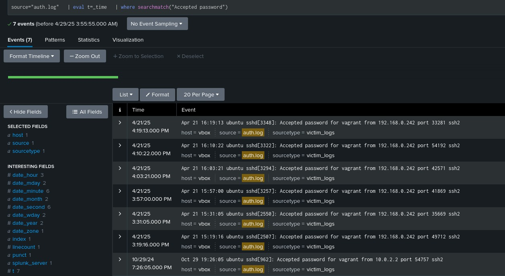
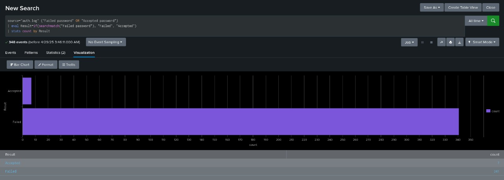
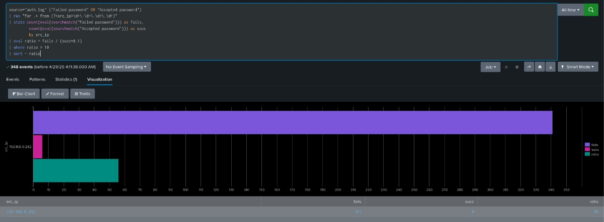
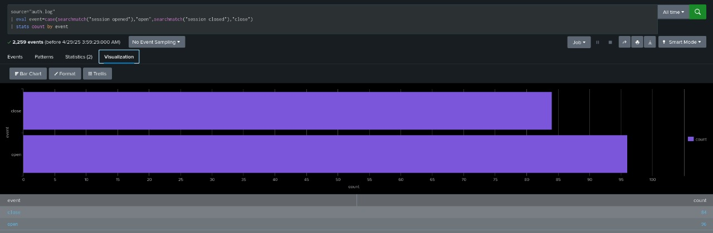

# 📌 Phase 2: SIEM Dashboard Analysis

## Overview
In Phase 2, we integrated authentication logs from our victim environment (Metasploitable3) into Splunk and performed a visual analysis of SSH login activity. The goal is to extract meaningful patterns from the logs and identify potential brute-force or anomalous login attempts.

> **Note:** Since Splunk Universal Forwarder isn't available for macOS, logs from Metasploitable3 were sent to Kali Linux, and Splunk on Kali was configured to read and index them from a local directory.

## Screenshot 1: Accepted SSH Password Events
  
**Description:** This screenshot shows the Splunk search results for successful SSH login events. We used the query:
```bash
source="auth.log" | eval t=_time | where searchmatch("Accepted password")
```


It returns all entries where a password was accepted, listing timestamps and source IP addresses. In our dataset, we see 7 accepted logins, indicating successful authentication instances.

## Screenshot 2: Failed vs. Accepted Login Counts
  
**Description:** This bar chart compares the total number of failed and successful SSH login attempts. The search query used was:
```bash
source="auth.log" ("Failed password" OR "Accepted password") | eval Result=if(searchmatch("Failed password"), "Failed", "Accepted") | stats count by Result
```

The results show 341 failed attempts versus 7 successful attempts, revealing a high volume of unsuccessful login trials—potentially indicating brute-force activity.


## Screenshot 3: Failed-to-Success Ratio by Source IP
  
**Description:** Here we drill down by source IP to calculate the ratio of failed to successful login attempts. The Splunk query:
```bash
source="auth.log" ("Failed password" OR "Accepted password") | rex "for .* from (?<src_ip>\d+.\d+.\d+.\d+)" | stats count(eval(searchmatch("Failed password"))) as fails, count(eval(searchmatch("Accepted password"))) as succ by src_ip | eval ratio = fails/(succ+0.1) | where ratio > 10 | sort - ratio
```

identifies IP addresses with a failure/success ratio greater than 10. The IP `192.168.0.242` has 341 failures and only 6 successes, yielding a ratio of ~56, confirming suspicious behavior from this host.

## Screenshot 4: SSH Session Open vs Close Events
  
**Description:** This visualization counts SSH session open and close events to assess overall session activity. Query used:
```bash
source="auth.log" | eval event=case( searchmatch("session opened"), "open", searchmatch("session closed"), "close" ) | stats count by event
```

The chart shows 96 session opens and 84 session closes, indicating some sessions may not have been properly closed or logs are incomplete, which could warrant further investigation.

---

