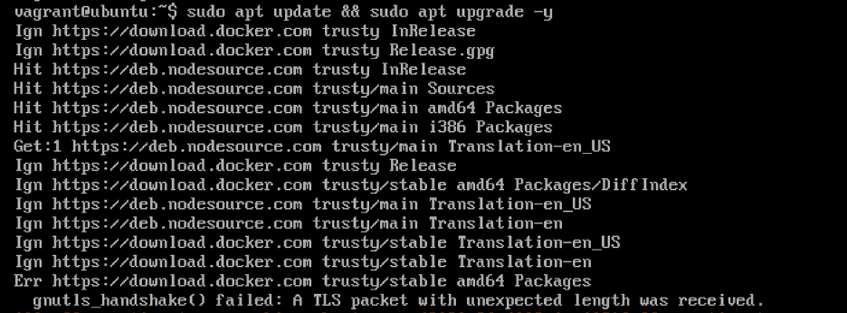
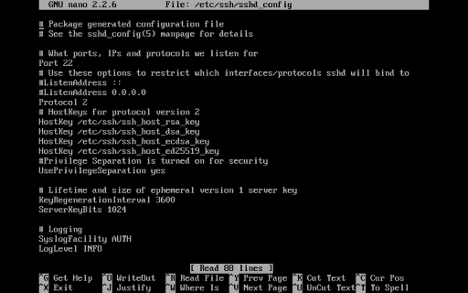
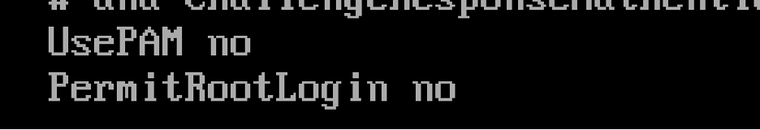
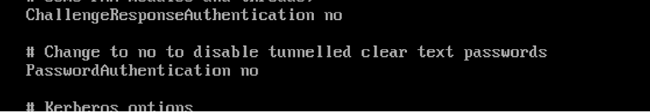
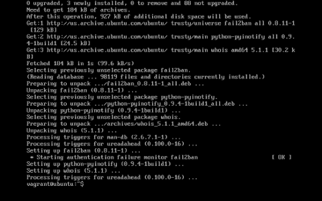
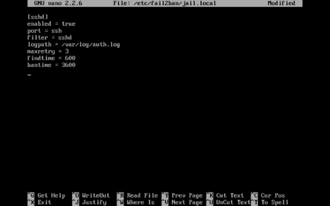
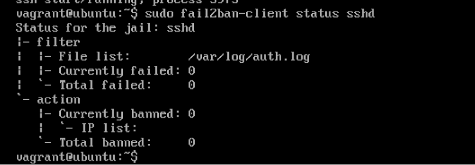
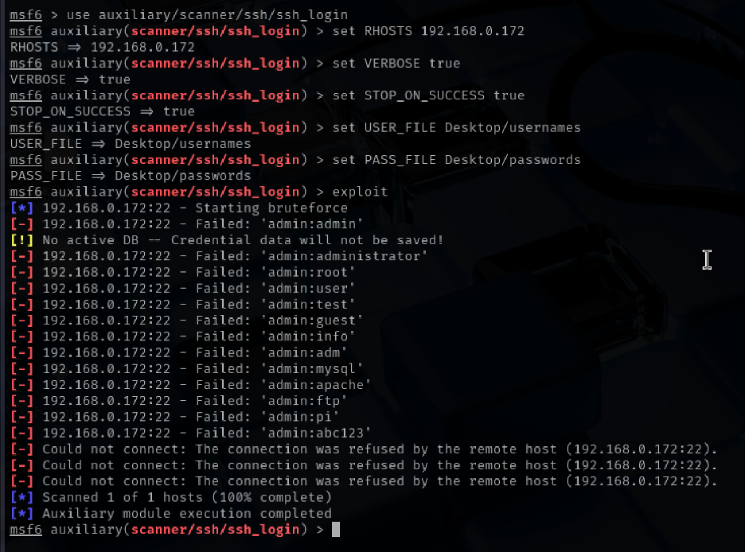
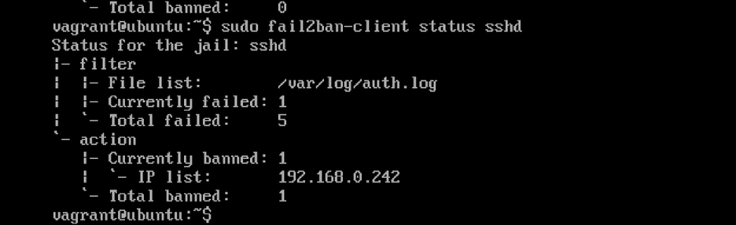

# 📌 Phase 3: Defensive Strategy Proposal – SSH Brute Force Attack

## 1. Defensive Strategy

We found that SSH on the victim machine is vulnerable to **brute-force attacks**, where the attacker tries many username and password combinations to break in.

To stop this, we will:

- Turn off root login to avoid easy username guessing.
- Disable password-based login and allow only SSH keys (very hard to brute-force).
- Use Fail2Ban to automatically block any IP that fails to log in multiple times.
- Keep the system updated with security patches.

## 2. Implementation (Defense Setup)

### Step 1: Update System Packages

```bash
sudo apt update && sudo apt upgrade -y
```
<p align="center">
  
  <br><em>System update command</em>
</p>

This command updates all software to the latest version to patch known vulnerabilities.

### Step 2: Harden SSH Configuration

Open SSH settings:

```bash
sudo nano /etc/ssh/sshd_config
```

<p align="center">
  
  <br><em>SSH configuration file</em>
</p>

Add these lines:

```
PermitRootLogin no
PasswordAuthentication no
ChallengeResponseAuthentication no
UsePAM no
```

<p align="center">
  
  
  <br><em>Edited SSH configuration</em>
</p>

**What this does:**

- `PermitRootLogin no`: Blocks login using the `root` username.
- `PasswordAuthentication no`: Disables password login completely (stops brute-force).
- Others help ensure only key-based login works.

Restart SSH to apply:

```bash
sudo systemctl restart ssh
```

### Step 3: Install and Configure Fail2Ban

Install:

```bash
sudo apt install fail2ban -y
```

<p align="center">
  
  <br><em>Fail2Ban installation</em>
</p>

Edit jail configuration:

```bash
sudo nano /etc/fail2ban/jail.local
```

Add:

```
[sshd]
enabled = true
port = ssh
filter = sshd
logpath = /var/log/auth.log
maxretry = 3
findtime = 600
bantime = 3600
```

<p align="center">
  
  <br><em>Fail2Ban configuration</em>
</p>

The above commands :

- Watches for SSH login failures.
- If someone fails too many times in few minutes, they are banned for 1 hour.

Restart Fail2Ban:

```bash
sudo systemctl restart fail2ban
```

Check status:

```bash
sudo fail2ban-client status sshd
```

<p align="center">
  
  <br><em>Fail2Ban status</em>
</p>

---

## 3. Run the Brute-Force Attack (After Defense)

After you’ve:

- Disabled password login
- Enabled Fail2Ban

Try the **same Metasploit module** or **script** again.

<p align="center">
  
  <br><em>Brute-force attack attempt</em>
</p>

**Expected result:**

- SSH password login fails completely.

Check ban status:

```bash
sudo fail2ban-client status sshd
```
<p align="center">
  
  <br><em>Fail2Ban status</em>
</p>

## 5. Final Result (Before vs After)

**Before Defense:**

- Attacker finds username and password
- Gains access using brute force

**After Defense:**

- Root and password login blocked
- Brute force fails
- IP is banned automatically
- No access possible

This proves our defense worked effectively.

